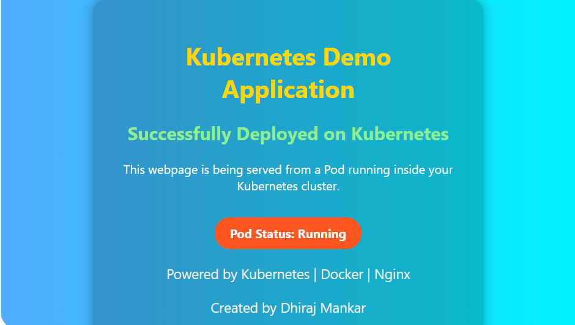

# Kubernetes ConfigMaps & Secrets – Hands-On Lab

## Overview

This repository contains hands-on Kubernetes exercises focused on understanding and implementing ConfigMaps and Secrets for application configuration management and secure handling of sensitive information.

In modern Kubernetes environments, application configuration should be decoupled from container images to improve portability, maintainability, and operational flexibility. This project demonstrates how Kubernetes ConfigMaps and Secrets can be used to provide configuration and sensitive data to workloads without modifying application code or rebuilding container images.

As part of this lab, a custom HTML webpage was stored within a ConfigMap, mounted into an Nginx container using a volume, and exposed externally through a NodePort Service. This demonstrates how application content can be dynamically managed and updated independently of the underlying container image.

---

## Learning Objectives

This project covers the following Kubernetes concepts:

* Creating and managing ConfigMaps
* Creating and managing Secrets
* Consuming ConfigMaps as Environment Variables
* Consuming ConfigMaps as Mounted Volumes
* Consuming Secrets as Environment Variables
* Consuming Secrets as Mounted Volumes
* Understanding namespace-scoped resources
* Managing application configuration independently from container images
* Serving static web content from ConfigMap data
* Exposing applications externally using Kubernetes Services
* Understanding dynamic update behavior of ConfigMaps and Secrets
* Following Kubernetes configuration management best practices

---

## Project Components

---

## Browser Validation

### ConfigMap-Powered Web Application

As part of this exercise, a custom HTML webpage was stored within a Kubernetes ConfigMap and mounted into an Nginx container using a Volume Mount.

The application was exposed externally through a NodePort Service and successfully accessed through a web browser. This validates:

- ConfigMap consumption through Volumes
- Static content delivery through Nginx
- Service-to-Pod connectivity
- NodePort Service exposure
- End-to-end application accessibility

### Application Output



### ConfigMap

The ConfigMap was used to store both application configuration and static web content.

Configuration values such as application settings were injected into the container as environment variables, while a custom HTML page was stored as ConfigMap data and mounted into the container filesystem using a volume.

This demonstrates how ConfigMaps can be used to manage:

* Application settings
* Environment-specific configuration
* Static files
* Configuration files
* Web content

without modifying the underlying container image.

---

### Secret

A Kubernetes Secret was used to store sensitive application information such as credentials.

The Secret was consumed using two common approaches:

#### Environment Variables

Secret values were injected into the container runtime environment, allowing applications to securely consume credentials without hardcoding them into source code or manifests.

#### Mounted Volumes

Secret data was also mounted into the container filesystem as files, demonstrating an alternative and commonly used method for securely delivering sensitive information to workloads.

This approach aligns with Kubernetes security best practices by separating confidential information from application code and deployment configuration.

---

### Deployment

A Kubernetes Deployment was created to manage application availability and lifecycle.

The Deployment demonstrates:

* ConfigMap consumption through Environment Variables
* ConfigMap consumption through Mounted Volumes
* Secret consumption through Environment Variables
* Secret consumption through Mounted Volumes
* Containerized application deployment using Nginx

This provides a complete example of how Kubernetes workloads can consume both configuration and sensitive information through multiple delivery mechanisms.

---

### Service

A NodePort Service was created to expose the application externally.

The Service was responsible for:

* Selecting Pods using Kubernetes labels
* Routing traffic to the application Pods
* Providing external access to the application
* Enabling browser-based access to the webpage served by Nginx

The application was successfully accessed through a browser using the NodePort endpoint.

---

## Configuration Delivery Methods Demonstrated

One of the primary objectives of this lab was to understand the different methods available for providing configuration and secrets to applications running inside Kubernetes.

### Environment Variables

ConfigMaps and Secrets can be injected directly into containers as environment variables.

This approach is useful when:

* Applications read configuration during startup
* Configuration consists of simple key-value pairs
* Runtime settings need to be easily accessible by the application

Examples demonstrated in this project include:

* Application configuration values
* Environment-specific settings
* Database credentials stored in Secrets

---

### Mounted Volumes

ConfigMaps and Secrets can also be mounted as files inside the container filesystem.

This approach is useful when:

* Applications require configuration files
* Static web content needs to be delivered to the application
* Configuration should be maintained independently of the container image

In this project:

* ConfigMap data was mounted as a volume
* A custom index.html file was delivered through the ConfigMap
* Nginx served the ConfigMap-hosted webpage directly from the mounted volume
* Secret data was mounted as files within the container

This demonstrates a practical real-world use case for Kubernetes volume-based configuration management.

---

## Dynamic Update Behavior

An important concept explored during this lab was how Kubernetes handles updates to ConfigMaps and Secrets.

### Environment Variables

When ConfigMap or Secret values are injected as environment variables:

* Values are evaluated only when the Pod starts
* Updating the ConfigMap or Secret does not update running containers
* A Pod restart is required for changes to take effect

### Mounted Volumes

When ConfigMaps or Secrets are mounted as volumes:

* Kubernetes can update the mounted files when the underlying resource changes
* Applications must re-read the updated files to consume the changes
* This approach is better suited for applications that support dynamic configuration reloads

Understanding this behavior is essential when designing production-grade Kubernetes workloads.

---

## Validation Activities Performed

The following validation steps were performed during the implementation:

* Verified ConfigMap creation and contents
* Verified Secret creation and contents
* Confirmed ConfigMap values were injected as Environment Variables
* Confirmed Secret values were injected as Environment Variables
* Verified ConfigMap data mounted successfully as files
* Verified Secret data mounted successfully as files
* Validated mounted volume contents inside running containers
* Confirmed Nginx served content directly from ConfigMap data
* Verified Service-to-Pod connectivity
* Verified Service Endpoints
* Tested browser access through the NodePort Service
* Confirmed successful application delivery through Kubernetes networking components

---

## Repository Structure

The repository contains Kubernetes manifests demonstrating multiple approaches for working with ConfigMaps and Secrets. The files cover resource creation, workload deployment, service exposure, and configuration updates.

```text
ConfigMap & Secrets/
│
├── images/
│   └── configmap-demo-ui.png
│
├── README.md
├── cm.yaml
├── cmupdated.yaml
├── deployment-cm.yaml
├── deployment-secret.yaml
├── pod.yaml
├── secret.yaml
└── svc-cm.yaml
```

---

## File Overview

| File                   | Purpose                                                                                                                            |
| ---------------------- | ---------------------------------------------------------------------------------------------------------------------------------- |
| README.md              | Project documentation, implementation details, learning outcomes, validation steps, and best practices.                            |
| cm.yaml                | Initial ConfigMap containing application configuration values and static HTML content used within the lab.                         |
| cmupdated.yaml         | Updated version of the ConfigMap used to demonstrate configuration changes and update behavior.                                    |
| deployment-cm.yaml     | Deployment consuming ConfigMap data through Environment Variables and Volume Mounts.                                               |
| deployment-secret.yaml | Deployment consuming Secret data through Environment Variables and Volume Mounts.                                                  |
| pod.yaml               | Standalone Pod manifest used to validate ConfigMap and Secret consumption before deploying workloads through Deployments.          |
| secret.yaml            | Kubernetes Secret containing sensitive application data used throughout the lab exercises.                                         |
| svc-cm.yaml            | NodePort Service used to expose the Nginx application externally and provide browser-based access to the ConfigMap-hosted webpage. |

```
```


## Practical Kubernetes Commands Used

The following kubectl commands were used throughout the implementation and validation of this lab.

### Resource Deployment

```bash
kubectl apply -f <file-name>.yaml
```

Used to create and update Kubernetes resources from declarative manifests.

### Resource Verification

```bash
kubectl get configmaps
kubectl get secrets
kubectl get deployments
kubectl get pods
kubectl get svc
kubectl get endpoints
```

Used to verify successful creation of resources and validate application availability.

### Resource Inspection

```bash
kubectl describe configmap <configmap-name>
kubectl describe secret <secret-name>
kubectl describe deployment <deployment-name>
kubectl describe svc <service-name>
```

Used to inspect resource configuration and troubleshoot deployment issues.

### Container Validation

```bash
kubectl exec <pod-name> -- printenv
```

Used to verify ConfigMap and Secret values injected as Environment Variables.

```bash
kubectl exec <pod-name> -- cat <file-path>
```

Used to verify ConfigMap and Secret data mounted as files within the container filesystem.

### Deployment Management

```bash
kubectl rollout restart deployment <deployment-name>
```

Used to restart Pods and refresh application configuration after updates.

### Troubleshooting

```bash
kubectl logs <pod-name>
```

Used to review container logs and troubleshoot application issues.

---

## Secret Encoding and Decoding

Kubernetes Secrets store values as Base64-encoded data within manifest files.

It is important to understand that Base64 encoding is not encryption. It simply converts data into a transport-friendly format and should not be considered a security mechanism by itself.

### Encode a Secret Value

```bash
echo -n 'demogameuser' | base64
```

Example output:

```text
ZGVtb2dhbWV1c2Vy
```

### Decode a Secret Value

```bash
echo 'ZGVtb2dhbWV1c2Vy' | base64 --decode
```

Example output:

```text
demogameuser
```

### Security Considerations

While Kubernetes Secrets provide a better mechanism for handling sensitive information than ConfigMaps, additional security controls should be considered in production environments:

* Enable Encryption at Rest for Secrets stored in etcd
* Restrict Secret access using RBAC
* Avoid storing Secrets directly in source control repositories
* Use external secret management platforms where appropriate
* Follow the principle of least privilege for Secret access

---

## Validation Commands

The following commands were used to validate successful implementation of ConfigMaps, Secrets, Deployments, Services, and mounted volumes.

### Verify ConfigMap

```bash
kubectl get configmap
kubectl describe configmap <configmap-name>
```

### Verify Secret

```bash
kubectl get secret
kubectl describe secret <secret-name>
```

### Verify Deployment

```bash
kubectl get deployment
kubectl describe deployment <deployment-name>
```

### Verify Pods

```bash
kubectl get pods
kubectl describe pod <pod-name>
```

### Verify Services

```bash
kubectl get svc
kubectl describe svc <service-name>
```

### Verify Service Endpoints

```bash
kubectl get endpoints
```

### Verify Environment Variables

```bash
kubectl exec <pod-name> -- printenv
```

### Verify Mounted Files

```bash
kubectl exec <pod-name> -- ls <mount-path>

kubectl exec <pod-name> -- cat <mounted-file>
```

### Verify Application Accessibility

```bash
curl http://<node-ip>:<nodeport>
```

Or access the application directly through a browser using the NodePort Service endpoint.


## Key Learnings

Throughout this lab, the following important Kubernetes concepts were reinforced:

* ConfigMaps are designed for non-sensitive configuration data.
* Secrets are intended for sensitive information such as credentials and tokens.
* ConfigMaps and Secrets are namespace-scoped resources.
* Configuration should be externalized rather than embedded within container images.
* Environment Variables and Mounted Volumes each serve different configuration management use cases.
* Kubernetes Services use labels and selectors to route traffic to Pods.
* NodePort Services provide a simple mechanism for exposing applications externally.
* Configuration can be modified independently of application deployments.
* Static content can be delivered directly from ConfigMaps without rebuilding container images.
* Proper separation of code, configuration, and secrets improves maintainability and security.

---

## Best Practices

The following best practices were applied and reinforced during this exercise:

* Avoid storing sensitive information in ConfigMaps.
* Use Secrets for passwords, tokens, and confidential data.
* Restrict Secret access using Role-Based Access Control (RBAC).
* Enable encryption at rest for Kubernetes Secrets in production environments.
* Store Kubernetes manifests in source control for versioning and auditability.
* Prefer declarative deployments for repeatable and consistent environments.
* Mount only the configuration data required by the application.
* Separate application code from configuration and secrets.
* Consider external secret management solutions for enterprise environments.

---

## Technologies Used

* Kubernetes
* ConfigMaps
* Secrets
* Deployments
* Services
* Volumes
* Environment Variables
* NodePort
* Nginx
* YAML
* Kubectl

---

## Outcome

This lab provided practical experience with Kubernetes configuration and secret management using both Environment Variables and Volume Mounts.

The implementation demonstrated how ConfigMaps can be used to manage application settings and static web content, while Secrets can be used to securely provide sensitive information to workloads. A custom HTML application was delivered through a ConfigMap volume, served by Nginx, and exposed externally using a NodePort Service.

The concepts covered in this repository closely align with real-world Kubernetes administration practices and provide hands-on experience with topics commonly encountered in the Certified Kubernetes Administrator (CKA) certification.

---

## Author

Dhiraj Mankar

Senior Azure DevOps & Platform Engineer

Certified Kubernetes Administrator (CKA) Preparation Repository
